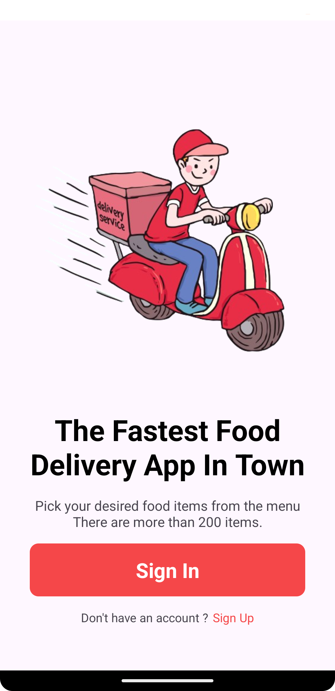
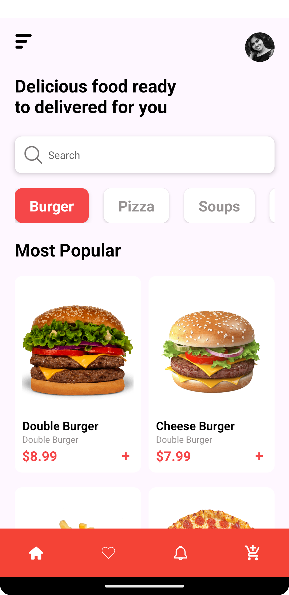
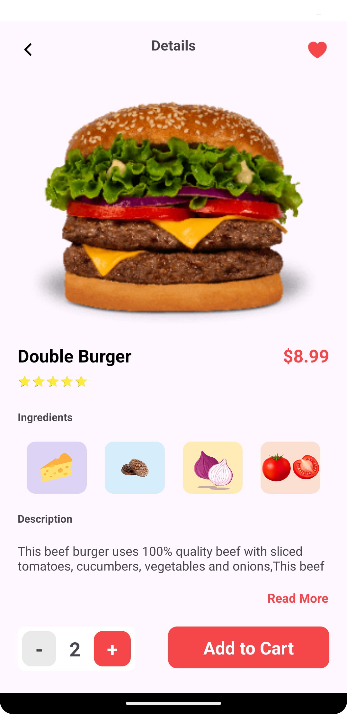

# Food Delivery Homework

This project was created during the BrainerX Mobile Bootcamp, featuring food delivery screens and data sharing between them. It also integrates the Picasso library for image handling.

## Screens

  
  
  

